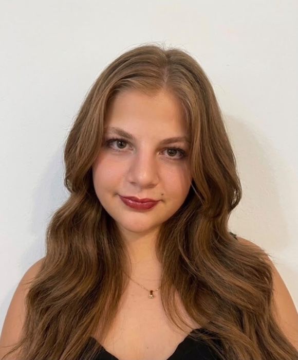

Título: Resolução de Desafios no Blockly Games: Maze (10) e Desenho de um Barco no Turtle 

Autor: Sarah Dos Santos Martins e Silva, 113606

Resumo: 

No desafio do Maze tivemos como objetivo a construção de um algoritmo que permitiria conduzir a personagem até à meta, recorrendo a estruturas condicionadas encadeadas dentro de um ciclo de repetições.

No desafio do Turtle foi ilustrada a imagem de um barco com nuvens, sol, ondas e um ponto.

A ilustração no Turtle exigiu o controlo das condições (pen up/down, transição de cores, deslocamento do cursor tendo em conta o ângulo ou distância de deslocamento, repetições...) para ilustrar todas as características dos elementos como linhas curvas e círculos.

Lista de Resultados: 

Resolução do Maze- 

[Código e resultado do Barco (Turtle)- (ver todas as imagens)](Resultados.md)

